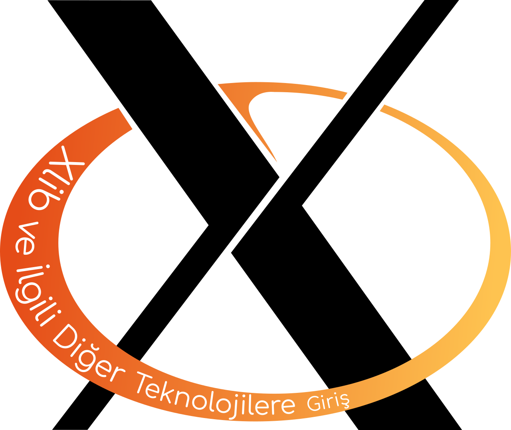

<!-- [comment]: <> (--- title: "Xlib ve İlgili Diğer Teknolojilere Giriş" author: [Anıl Özbek] date: "2019-01-06" keywords: [xlib, x, xorg, linux] ...)-->

# Xlib ve İlgili Diğer Teknolojilere Giriş



## İçindekiler
- [Giriş](./giris/README.md)
- [Bölüm 0 - Bir Pencere Oluşturma](./bir-pencere-olusturma/README.md)
- [Bölüm 1 - Uygulamayı Kapatma](./uygulamayi-kapatma/README.md)
- [Bölüm 2 - Minimum Boyut](./minimum-boyut/README.md)
- [Bölüm 3 - Pencereyi Büyütme](./pencereyi-buyutme/README.md)
- [Bölüm 4 - Daha İyi Kapatma](./daha-iyi-kapatma/README.md)
- [Bölüm 5 - Arabellek](./arabellek/README.md)
- [Bölüm 6 - Değişen pencere boyutuna uyum](./degisen-pencere-boyutuna-uyum/README.md)
- [Bölüm 7 - Bu titreme hakkında...](./bu-titreme-hakkinda/README.md)
- [Bölüm 8 - KeyPress ve KeyRelease](./keypress-ve-keyrelease/README.md)
- [Bölüm 9 - XInput'tan UTF-8 Karakterler (Hayır, oyun çubuğu olanından değil)](./utf8/README.md)
- [Sonuç](./sonuc/README.md)

## Derleme

Rehberi doğrudan GitHub üzerinden okuyabileceğiniz gibi PDF ve EPUB gibi biçimlere çevirip bu dosyalardan da okuyabilirsiniz. Örneğin PDF olarak derlemek için uzun kod satırları sorunlu olsa da iş görecek şu basit yöntemi kullanabilirsiniz:

```bash
pandoc README.md \
       giris/README.md \
       bir-pencere-olusturma/README.md \
       uygulamayi-kapatma/README.md \
       minimum-boyut/README.md \
       pencereyi-buyutme/README.md \
       daha-iyi-kapatma/README.md \
       arabellek/README.md \
       degisen-pencere-boyutuna-uyum/README.md \
       bu-titreme-hakkinda/README.md \
       keypress-ve-keyrelease/README.md \
       utf8/README.md \
       sonuc/README.md --pdf-engine=xelatex -o xlib-rehberi.pdf
```

[pandoc-latex-template](https://github.com/Wandmalfarbe/pandoc-latex-template) veya benzeri bir şablonla daha iyi sonuçlar elde etmeniz olası, [örneğin](./xlib-rehberi.pdf):

```bash
pandoc README.md \
       giris/README.md \
       bir-pencere-olusturma/README.md \
       uygulamayi-kapatma/README.md \
       minimum-boyut/README.md \
       pencereyi-buyutme/README.md \
       daha-iyi-kapatma/README.md \
       arabellek/README.md \
       degisen-pencere-boyutuna-uyum/README.md \
       bu-titreme-hakkinda/README.md \
       keypress-ve-keyrelease/README.md \
       utf8/README.md \
       sonuc/README.md --pdf-engine=xelatex -o xlib-rehberi.pdf --template eisvogel --highlight-style kate
```

Son olarak [EPUB](./xlib-rehberi.epub) ürütemi içinse şunu kullanabilirsiniz:

```bash
pandoc README.md \
       giris/README.md \
       bir-pencere-olusturma/README.md \
       uygulamayi-kapatma/README.md \
       minimum-boyut/README.md \
       pencereyi-buyutme/README.md \
       daha-iyi-kapatma/README.md \
       arabellek/README.md \
       degisen-pencere-boyutuna-uyum/README.md \
       bu-titreme-hakkinda/README.md \
       keypress-ve-keyrelease/README.md \
       utf8/README.md \
       sonuc/README.md -o xlib-rehberi.epub
```
